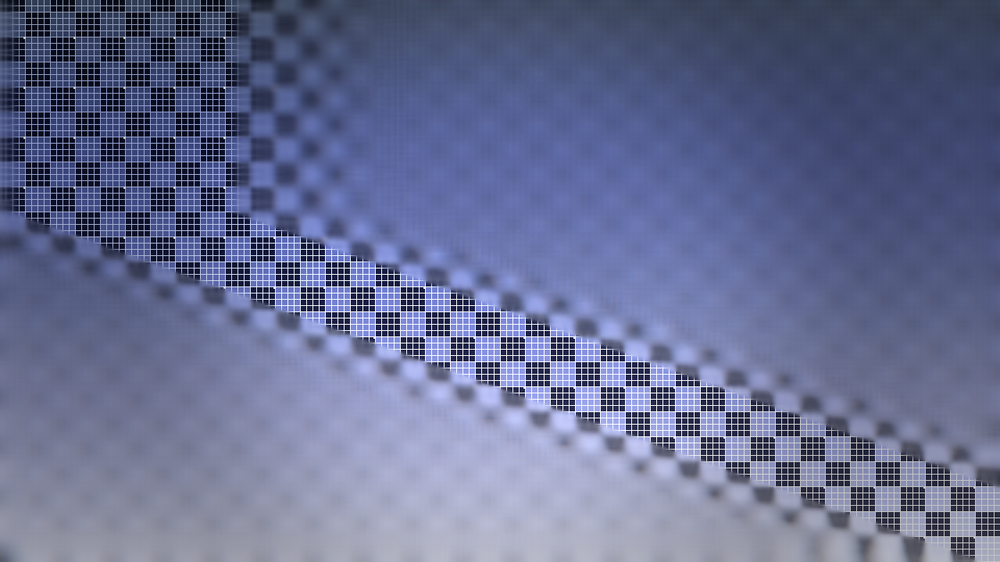
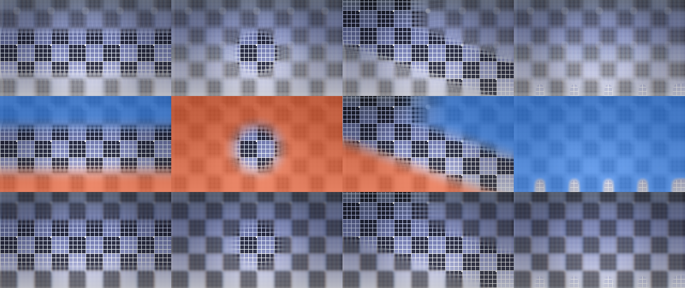

# Tilter

> **AI-assisted project.** This codebase was created with [Claude](https://claude.com/claude-code)
> (Anthropic), directed and reviewed by a human author. The lens is verified
> numerically by an offline harness that drives the real plugin class in a
> headless GL context: it compares the circle-of-confusion field the GPU
> actually wrote against an independent C++ implementation across all four focus
> shapes — agreeing to the last bit 16-bit float storage can hold — walks the
> blur control and demands the picture get smoother, and measures the aperture's
> shape and size in the rendered frame (see [Status](#status)). The FFGL build
> has been **loaded into Resolume Arena and confirmed working**; the OpenFX build
> has only ever been driven by a test probe, never opened in Resolve. Check it in
> your own rig before trusting it in a show.

A tilt-shift lens for [Resolume](https://resolume.com) Arena and Avenue, as an
FFGL plugin — and the same thing again as an OpenFX plugin for Resolve, Nuke,
Natron and Vegas. It puts a shallow plane of focus across your footage and a
real aperture behind it, which is the trick that makes a city look like a model
railway.



<sub>The Tilted Plane shape with Tilt off neutral: the plane of focus is swung
about the viewing axis, so the sharp zone converges across the frame instead of
lying parallel to the horizon. Rendered by `tiltest`, the offline harness.</sub>



<sub>Top row: the four focus shapes through the bokeh path. Middle row: the same
four fields, shown by Show Focus — cold is the far side of focus, warm is the
near side. Bottom row: the same four again through the cheaper Gaussian path.</sub>

**Try it in your browser, with your own footage:**
[tilter-demo.stoatworks-labs.com](https://tilter-demo.stoatworks-labs.com) — the
plugin's own shaders in WebGL2. Nothing is uploaded.

**Video:** [What it does, in 49 seconds](https://www.youtube.com/watch?v=_CCMEQP3S94)

<!-- downloads:start -->

## Download

**[v0.1.3](https://github.com/stoatworks-labs/tilter/releases/tag/v0.1.3)** — prebuilt for macOS, Windows and Linux. Pick your platform:

<details>
<summary><b>macOS</b> — Universal (Apple Silicon + Intel)</summary>

| Build | Download | Size |
| --- | --- | --- |
| Universal (Apple Silicon + Intel) · .dmg disk image | [`tilter-0.1.3-macos-universal.dmg`](https://github.com/stoatworks-labs/tilter/releases/download/v0.1.3/tilter-0.1.3-macos-universal.dmg) | 214 KB |
| Universal (Apple Silicon + Intel) · .zip archive | [`tilter-macos-universal.zip`](https://github.com/stoatworks-labs/tilter/releases/latest/download/tilter-macos-universal.zip) | 177 KB |
| Universal (Apple Silicon + Intel) · .zip archive (OpenFX — Resolve, Vegas, Nuke) | [`tilter-ofx-macos-universal.zip`](https://github.com/stoatworks-labs/tilter/releases/latest/download/tilter-ofx-macos-universal.zip) | 275 KB |

</details>

<details>
<summary><b>Windows</b> — x64</summary>

| Build | Download | Size |
| --- | --- | --- |
| x64 · .exe installer | [`tilter-0.1.3-windows-x86_64-setup.exe`](https://github.com/stoatworks-labs/tilter/releases/download/v0.1.3/tilter-0.1.3-windows-x86_64-setup.exe) | 219 KB |
| x64 · .zip archive | [`tilter-windows-x86_64.zip`](https://github.com/stoatworks-labs/tilter/releases/latest/download/tilter-windows-x86_64.zip) | 113 KB |
| x64 · .zip archive (OpenFX — Resolve, Vegas, Nuke) | [`tilter-ofx-windows-x86_64.zip`](https://github.com/stoatworks-labs/tilter/releases/latest/download/tilter-ofx-windows-x86_64.zip) | 81 KB |

</details>

<details>
<summary><b>Linux</b> — x64</summary>

| Build | Download | Size |
| --- | --- | --- |
| x64 · .zip archive (OpenFX — Resolve, Vegas, Nuke) | [`tilter-ofx-linux-x86_64.zip`](https://github.com/stoatworks-labs/tilter/releases/latest/download/tilter-ofx-linux-x86_64.zip) | 728 KB |

</details>

All builds, checksums and release notes: [github.com/stoatworks-labs/tilter/releases](https://github.com/stoatworks-labs/tilter/releases).

macOS builds are signed and notarised and open normally. The Windows builds are unsigned, so SmartScreen warns once.

<!-- downloads:end -->

## What it does

A tilt-shift lens is one whose focal plane is not parallel to the sensor.
Photographers bought them to keep buildings from leaning; everyone else
discovered that pointing one at a city from a long way up makes it look like a
model, because a plane of focus that shallow is something the eye only ever sees
on things a few inches across.

**One idea runs through the whole plugin:** it works out how far each pixel is
from focus, and then a blur consumes that. The two halves are independent, so
you pick the shape of the focus and the character of the blur separately.

### Four ways to choose what is sharp

| Shape | What it is |
| --- | --- |
| **Linear Band** | The classic. A sharp strip at any angle, feathered either side. |
| **Radial** | A sharp ellipse — for a subject in the middle of frame rather than a horizon. |
| **Tilted Plane** | A real lens's falloff, with a horizon. See below. |
| **Image Depth** | Guesses depth from the picture itself. Honestly a guess; see below. |

**Tilted Plane is the one worth understanding.** For a flat subject a real
tilted lens's sharp region is *exactly* a straight band, so this is not a
differently-shaped Linear Band. What it gives you is the **falloff**. A real
lens blurs by the difference in *inverse* depth, and nothing is further away
than infinity — so on the far side the blur ramps up and then **stops** at the
horizon, and the sky, the distant hills and the backs of the buildings all share
one blur. On the near side it grows without limit. A plain linear band ramps
symmetrically and forever in both directions, and that asymmetry is the thing
people's eyes pick up on when a fake tilt-shift looks wrong.

`Tilt` then swings the focal plane so the sharp zone converges across the frame,
the way it does in a real tilt-shift photograph.

**Image Depth is labelled a guess in the dropdown because it is one.** Distance
scatters light: contrast washes out and brightness lifts, so smooth bright
regions are treated as far away and detailed dark ones as near. That is right
often enough to be useful on landscape and cityscape footage, and wrong on
anything with a bright foreground or a dark sky. There is no depth channel
coming out of Resolume, so this is inference from the picture and nothing more.

### Two blurs

**Bokeh Disc** gathers over a real aperture — circular, or 5 to 9 blades — and
weights each sample by its own brightness, so highlights bloom into visible
aperture shapes instead of smearing. That is the whole reason to stop a lens
down and the reason this mode exists.

**Gaussian** is the cheap one: two separable passes, clean and fast, but a
bright point spreads into a soft blob rather than a disc.

Either way the blur runs on a box-downsampled copy of the picture at a scale
chosen from the radius. That is not only for speed — a sparse gather *aliases*
its own source, and the artefact gets worse as the blur gets larger, which is
the opposite of what anyone expects. See `AGENTS.md`.

### And the rest of the photograph

`Saturation` and `Contrast` push the picture the way a photograph of a small
brightly lit object looks. `Vignette` and `Aberration` are the lens: aberration
scales with defocus and reverses across the plane of focus, because that is what
real glass does.

`Show Focus` paints the field over the picture so you can place a focal plane by
looking at it rather than by squinting at softness.

## Status

Verified on macOS 26.4 by `tools/verify.sh`:

- **The focus field matches its GLSL mirror** for all four shapes. The three
  analytic ones agree at exactly the 16-bit-float quantum (0.00049) — as close
  as the buffer can represent — and the test carries a control case comparing
  against the wrong shape, which must and does disagree.
- **The blur blurs where it should and only there**: the sharp band keeps its
  detail, the far field loses it, and detail falls monotonically as the blur
  rises.
- **The aperture reaches the picture**: a circular iris spreads a highlight over
  the disc its radius predicts, six blades cover 0.87 of that area (geometry
  says 0.83), and halving the radius quarters the area.
- **Every factory preset is distinct and none is degenerate.**
- macOS build is universal (arm64 + x86_64) and exports `plugMain`.

**Loaded into Resolume Arena on macOS and confirmed working** — so the plugin
registers, instantiates and renders in a real host, which is the one thing an
offline harness cannot tell you. What that does *not* cover: the **OpenFX build
has never been opened in Resolve**, only driven by `ofxprobe`; the Windows build
is made in CI and has never been run; and none of it has been used on a live
show.

One known limit, which is a property of the method rather than a bug: an
isolated highlight of only two or three pixels will not form a clean bokeh disc,
because a gather blur takes too few samples of it. Highlights of roughly ten
pixels and up bokeh correctly. `AGENTS.md` explains why, and what the fix would
have cost.

## Building

Needs CMake and a C++17 compiler. The FFGL SDK is a submodule.

```bash
git clone --recursive https://github.com/stoatworks-labs/tilter
```

```bash
cmake -B build -DCMAKE_BUILD_TYPE=Release && cmake --build build
```

`cmake --install build` drops the bundle into your Resolume plugin folder.
`CLAUDE.md` is the full command reference; `AGENTS.md` is the design and the
traps.

<!-- attributions:start -->
This project is built on other people's work — see [ATTRIBUTIONS.md](ATTRIBUTIONS.md).
<!-- attributions:end -->

## Licence

MIT — see [LICENCE](LICENSE). The Resolume FFGL SDK is under its own licence;
the OpenFX SDK subset vendored under `external/openfx` is BSD-3.
